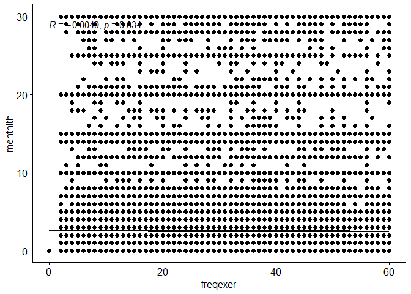
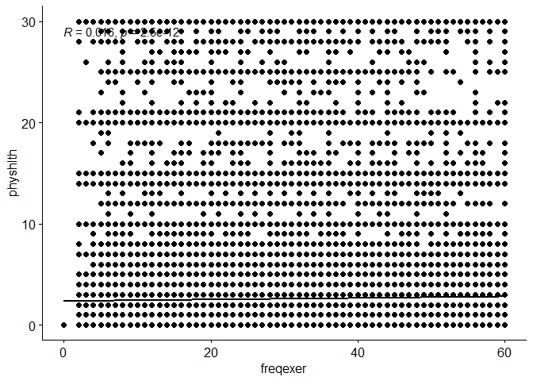

## Setup

### Load packages

``` r
#install.packages("ggpubr")
library(ggplot2)
library(dplyr)
library("ggpubr")
library(data.table)
```

### Load data

Make sure your data and R Markdown files are in the same directory. When
loaded your data file will be called `brfss2013`. Delete this note when
before you submit your work.

``` r
load("brfss2013.RData")
#head(brfss2013)
```

------------------------------------------------------------------------

## Part 1: Data

#### Describe how the observations in the sample are collected, and the implications of this data collection method on the scope of inference (generalizability / causality). Note that you will need to look into documentation on the BRFSS to answer this question. See <http://www.cdc.gov/brfss/> as well as the “More information on the data” section below.

What is The Behavioral Risk Factor Surveillance System (BRFSS)? -
According to <http://www.cdc.gov/brfss/>, ‘The Behavioral Risk Factor
Surveillance System (BRFSS) is the nation’s premier system of
health-related telephone surveys that collect state data about U.S.
residents regarding their health-related risk behaviors, chronic health
conditions, and use of preventive services. BRFSS is an ongoing
surveillance system designed to measure behavioral risk factors for the
non-institutionalized adult population (18 years of age and older)
residing in the US.’

What factors is the goal of BRFSS and what factors it cares about? - The
BRFSS objective is to collect uniform, state-specific data on preventive
health practices and risk behaviors that are linked to chronic diseases,
injuries, and preventable infectious diseases that affect the adult
population.

-   Factors assessed by the BRFSS in 2013 include tobacco use, HIV/AIDS
    knowledge and prevention, exercise, immunization, health status,
    healthy days — health-related quality of life, health care access,
    inadequate sleep, hypertension awareness, cholesterol awareness,
    chronic health conditions, alcohol consumption, fruits and
    vegetables consumption, arthritis burden, and seatbelt use.

How is the data collected? - BRFSS was initiated in 1984, and the data
is collective through monthly telephone interviews. - And since 2011,
BRFSS starts to collect surveys through both telephone and mobile
phones.

-   The data was initially sampled from 15 states, and now 53 states and
    districts (Guam pureto rico and D.C.) joined this program. So the
    data might include more samples from states joined earlier.

-   In conducting the BRFSS landline telephone survey, interviewers
    collect data from a randomly selected adult in a household. In
    conducting the cellular telephone version of the BRFSS
    questionnaire, interviewers collect data from an adult who
    participates by using a cellular telephone and resides in a private
    residence or college housing.

-   All data are collected from adult population.

Discussion: - The data is collected through landline or mobile phones
which means the samples only comes from people with a landline or mobile
phones. - The data might be biased to people who willing to answer the
phone or complete the survey. It is a very long survey, there might be
some statistic distributions among people who are willing to complete
the survey. For example, people who are very busy might not will to take
a long survey or just do not pay much attention to it. - In addition,
many of the questions aim to get the information for the past 30 days.
Responders may not have a good memory about those questions (e.g how
many days you feel sad in the past 30 days). - Another issues is
sometimes the response might be biased to more recent event. For
example, one might respond they don’t have sleep problems issues simply
because they have some good sleep this week. - Considering these
limitations, one should be carefully consider those bias before use the
data. \* \* \*

## Part 2: Research questions

**Research quesion 1:** - is Physical Activity associated with physical
health status and mental health status? - Variables: - physhlth: days
per month - menthlth: days per month - exercise frequency: - exeroft1:
Times - exerhmm1: hours and minutes - exeroft2: Times - exerhmm2: hours
and minutes - strength: Times

For simplicity, I use times per month as measurement for exercise
frequency and keep the same scale as pyhshlth and menthlth, which are
measured in the past month. Cloumn exeroft1, exeroft2 and exerhmm2
measure the times of exercise per week. The data represents in a format
of 3 digits where the first number denotes times per week (1) and
month(2). I simply convert times per week to times per month by multiply
the number by 4 assuming 4 weeks per month.

-   physhlth
-   menthlth
-   times of exercise: freqexer
    -   exeroft1, exeroft2, strength

Relevance: Many people argues that exercise is important for both mental
health and physcial health are important to people. It would be a solid
evidence of that calim if we could show there that more exercise leads
to lower mental unwellness days and physical unwellness days.

**Research quesion 2:**

-   How dose diabete relate with body fat (weight, height, BMI) and sex?
-   Variables:
    -   \_bmi5 : weight and height are correlated variables, instead of
        using raw height and weight, we use BMI to represent the
        objects’ body fat condition.
    -   sex
    -   diabetes3: (Ever Told You Have Diabetes)
        -   For simplicity, we only consider objects in diabete 3 that
            answered yes or no.

Relevance: Many people argues that exercise is important for both mental
health and physcial health are important to people. It would be a solid
evidence of that calim if we could show there that more exercise leads
to lower mental unwellness days and physical unwellness days.

**Research question 3:**

-   What is the relationship between education, Sugar-Sweetened Drinks,
    and Diabetes;

-   Variables: -ssbfru2:How Often Did You Drink Sugar-Sweetened Drinks?

    -   I’ll convert the data to the same metric with times per month.
    -   educa: education
        -   edcuation level ranges from 1 to 6 as kindergarden to
            college
    -   diabetes3:
        -   For simplicity, we only consider objects in diabete 3 that
            answered yes or no.

-   Relevance:

    -   Education level might influence a person’s awareness of eating
        healthy, and sugar drinks can be very big factor of causing
        diabetes, I would like to investigate the relationship between
        these factors.

Ho: Null Hypothesis, there is no statistically significant relationship
between them. Ha: Alternative Hypothesis, there are significant
relationship between these variables.

------------------------------------------------------------------------

## Part 3: Exploratory data analysis

**Research question 1:**

Is Physical Activity associated with physical health status and mental
health status?

The following are the functions to convert the raw data to desired
format

``` r
freq_per_month<- function(x){
  if(100< x & x <200) y <- 4 * (x - 100)
  else if(200< x & x<300) y <- (x - 200)
  else
    y <- 0
  return(y)
}
# assuming a person can not go excercise more than 60 times a month
filter_larger_freq<- function(x){
  if (x > 60) 
    y<- 60
  else
    y<-x
  return (y)
}
```

Preprocess data, extract valid data and remove outliers and analyze the
data

``` r
valid_all<-select(brfss2013, physhlth,menthlth,exeroft1,exeroft2,strength)
valid_all<-valid_all[complete.cases(valid_all),]

valid_all$freqexer<- sapply(valid_all$exeroft1, freq_per_month) + sapply(valid_all$exeroft2, freq_per_month) +sapply(valid_all$strength, freq_per_month)

#valid_all$freqexer<- sapply(valid_all$freqexer, filter_larger_freq)

valid_all<-select(valid_all, physhlth,menthlth,freqexer)
valid_all<-valid_all[valid_all$freqexer<=60,]
mental_health<-select(valid_all, menthlth,freqexer)
mental_health<-group_by(mental_health,menthlth)
```

plot figures

``` r
fig_mental_freqexer <- ggscatter(mental_health, x = "freqexer", y = "menthlth", 
          add = "reg.line", conf.int = TRUE, 
          cor.coef = TRUE, cor.method = "pearson",
          xlab = "freqexer", ylab = "menthlth")

physical_health<-select(valid_all, physhlth,freqexer)
physical_health<-group_by(physical_health,physhlth)

fig_phy_freqexer <- ggscatter(physical_health, x = "freqexer", y = "physhlth", 
          add = "reg.line", conf.int = TRUE, 
          cor.coef = TRUE, cor.method = "pearson",
          xlab = "freqexer", ylab = "physhlth")
```

**Visualization research question 1**

-   Fig 1: scatter plot of mental unwellness days and frequency of
    exercise

``` r
fig_mental_freqexer
```

    ## `geom_smooth()` using formula 'y ~ x'


- Fig 2: scatter plot of phycial unwellness days and frequency of
exercise

``` r
fig_phy_freqexer
```

    ## `geom_smooth()` using formula 'y ~ x'


- Fig-3 Heat map of between number of days mentally not feeling well vs
frequency of exercise days

``` r
frequency_matrix <- dcast(mental_health, menthlth ~ freqexer)
```

    ## Warning in dcast(mental_health, menthlth ~ freqexer): The dcast generic
    ## in data.table has been passed a grouped_df and will attempt to redirect
    ## to the reshape2::dcast; please note that reshape2 is deprecated, and this
    ## redirection is now deprecated as well. Please do this redirection yourself like
    ## reshape2::dcast(mental_health). In the next version, this warning will become an
    ## error.

    ## Using 'freqexer' as value column. Use 'value.var' to override

    ## Aggregation function missing: defaulting to length

``` r
x<-mental_health$menthlth
y<-mental_health$freqexer

heatmap(as.matrix(frequency_matrix), Rowv = NA, Colv = NA)
```


Fig-4 Heat map of between number of days physically not feeling well vs
number of execercise days

``` r
frequency_matrix <- dcast(physical_health, physhlth ~ freqexer)
```

    ## Warning in dcast(physical_health, physhlth ~ freqexer): The dcast generic
    ## in data.table has been passed a grouped_df and will attempt to redirect
    ## to the reshape2::dcast; please note that reshape2 is deprecated, and this
    ## redirection is now deprecated as well. Please do this redirection yourself like
    ## reshape2::dcast(physical_health). In the next version, this warning will become
    ## an error.

    ## Using 'freqexer' as value column. Use 'value.var' to override

    ## Aggregation function missing: defaulting to length

``` r
x<-physical_health$physhlth
y<-physical_health$freqexer

heatmap(as.matrix(frequency_matrix), Rowv = NA, Colv = NA)
```


-   Discussion:
-   scatter plot can not show the correlations between the variables.
-   we plot the heatmap between the two frequecy variables, as we can
    see from two plots, there are higher responsive areas in top left
    corner for both heatmaps. It shows that people with less exercise
    days have higher mental unwellness days and physical unwellness days

**Research question 2:**

-   How dose diabete relate with body fat (weight, height, BMI) and sex?
-   Variables:
    -   \_bmi5 : weight and height are correlated variables, instead of
        using raw height and weight, we use BMI to represent the
        objects’ body fat condition.
    -   sex
    -   diabetes3: (Ever Told You Have Diabetes)
        -   For simplicity, we only consider objects in diabete 3 that
            answered yes or no.
-   Relevance:
    -   Diabetes is a chronic health condition and it affects the body
        ability to turn food into energy. We would like to investigate
        if overweight people have a higher possibility of getting
        diabetes.

``` r
convert_2_implied_decimal<- function(x){
  return (x/100)
}


valid_all<-select(brfss2013, sex, X_bmi5, diabete3)
valid_all<-valid_all[complete.cases(valid_all),]
valid_all<-valid_all[valid_all$diabete3 == 'Yes' | valid_all$diabete3 == 'No',]

valid_all$X_bmi5<- sapply(valid_all$X_bmi5, convert_2_implied_decimal)

valid_all$diabete_numeric[valid_all$diabete3 == 'Yes'] <- 1
valid_all$diabete_numeric[valid_all$diabete3 == 'No'] <- 2

male_section <- valid_all[valid_all$sex == 'Male',]

male_section_positive <- male_section[male_section$diabete_numeric==1,]
male_section_negative <- male_section[male_section$diabete_numeric==2,]

female_section <- valid_all[valid_all$sex == 'Female',]

female_section_positive <- female_section[female_section$diabete_numeric==1,]
female_section_negative <- female_section[female_section$diabete_numeric==2,]

#https://www.r-graph-gallery.com/190-mirrored-histogram.html
#par(mfrow=c(2,1))

#par(mar=c(0,5,3,3))
#hist(male_section_negative$X_bmi5, main="" , xlim=c(0,80), ylab="male non diabete", xlab="", ylim=c(0, 30000) , las=1 , col="tomato3"  , breaks=80)

#par(mar=c(5,5,0,3))
#hist(male_section_positive$X_bmi5, main="" , xlim=c(0,80), ylab="male diabete", xlab="BMI", ylim=c(3000, 0) , las=1 , col="tomato3"  , breaks=80)


# First distribution
hist(male_section_negative$X_bmi5, breaks=80, xlim=c(0,80), col=rgb(1,0,0,0.25), xlab="BMI", 
     ylab="count", main="distribution of BMI of diabetes and non-diabetes" )

# Second with add=T to plot on top
hist(male_section_positive$X_bmi5, breaks=80, xlim=c(0,80), col=rgb(0,0,1,0.25), add=T)

# Third distribution
hist(female_section_negative$X_bmi5, breaks=80, xlim=c(0,80), col=rgb(0,1,1,0.25), add=T)

# Fourth with add=T to plot on top
hist(female_section_positive$X_bmi5, breaks=80, xlim=c(0,80), col=rgb(1,0,1,0.25), add=T)


# Add legend
legend("topright", legend=c("male non diabete","male diabete", "female non diabete", "female diabete"), col=c(rgb(1,0,0,0.25), 
     rgb(0,0,1,0.25), rgb(0,1,1,0.25), rgb(1,0,1,0.25)), pt.cex=2, pch=15 )
```


**Research question 3:**

-   What is the relationship between education, Sugar-Sweetened Drinks,
    and Diabetes;

-   Variables: -ssbfrut2:How Often Did You Drink Sugar-Sweetened Drinks?

    -   I’ll convert the data to the same metric with times per month.
    -   educa: education
        -   edcuation level ranges from 1 to 6 as kindergarden to
            college
    -   diabetes3:
        -   For simplicity, we only consider objects in diabete 3 that
            answered yes or no.

-   Relevance:

    -   Education level might influence a person’s awareness of eating
        healthy, and sugar drinks can be very big factor of causing
        diabetes, I would like to investigate the relationship between
        these factors.

Ho: Null Hypothesis, there is no statistically significant relationship
between them. Ha: Alternative Hypothesis, there are significant
relationship between these variables.

``` r
freq_per_month<- function(x){
  if(100< x & x <200) y <- 30 * (x - 100)
  else if(200< x & x<300) y <- 4 * (x - 200)
  else if(300< x & x<400) y <- (x - 300)
  else
    y <- 0
  return(y)
}
```

``` r
valid_all<-select(brfss2013, educa, ssbfrut2, diabete3)
valid_all<-valid_all[complete.cases(valid_all),]
#convert to numeric
valid_all$educa <- as.numeric(valid_all$educa) 
valid_all$freqsuda<- sapply(valid_all$ssbfrut2, freq_per_month)
#valid_all<-valid_all[valid_all$diabete3 == 'Yes' | valid_all$diabete3 == 'No',]
#valid_all$diabete_numeric[valid_all$diabete3 == 'Yes'] <- 1
#valid_all$diabete_numeric[valid_all$diabete3 == 'No'] <- 2
valid_all$diabete3 <- as.numeric(valid_all$diabete3)
```

``` r
hist(valid_all$freqsuda, main = "Histogram of number of sweetened suda consumed per month", xlab = "Number of suda Consumed ", ylab = "Frequency",
breaks=10000, xlim=c(0,80))
```


``` r
valid_all_vars <- select(valid_all, educa, freqsuda, diabete3)
cor(valid_all_vars)
```

    ##               educa    freqsuda   diabete3
    ## educa     1.0000000 -0.10446364 0.11236878
    ## freqsuda -0.1044636  1.00000000 0.04699033
    ## diabete3  0.1123688  0.04699033 1.00000000

``` r
lm <- lm(formula=valid_all_vars$diabete3~valid_all_vars$freqsuda+valid_all_vars$educa, data=valid_all_vars)
summary(lm)
```

    ## 
    ## Call:
    ## lm(formula = valid_all_vars$diabete3 ~ valid_all_vars$freqsuda + 
    ##     valid_all_vars$educa, data = valid_all_vars)
    ## 
    ## Residuals:
    ##     Min      1Q  Median      3Q     Max 
    ## -4.8751  0.1731  0.2078  0.3120  1.5534 
    ## 
    ## Coefficients:
    ##                          Estimate Std. Error t value Pr(>|t|)    
    ## (Intercept)             2.347e+00  1.048e-02  224.06   <2e-16 ***
    ## valid_all_vars$freqsuda 1.697e-03  8.902e-05   19.07   <2e-16 ***
    ## valid_all_vars$educa    7.878e-02  2.069e-03   38.07   <2e-16 ***
    ## ---
    ## Signif. codes:  0 '***' 0.001 '**' 0.01 '*' 0.05 '.' 0.1 ' ' 1
    ## 
    ## Residual standard error: 0.687 on 102566 degrees of freedom
    ## Multiple R-squared:  0.01611,    Adjusted R-squared:  0.01609 
    ## F-statistic: 839.9 on 2 and 102566 DF,  p-value: < 2.2e-16

Discussion: - From the histogram of people drink soda, we can see that
most people don’t drink sweetened soda. As we can see there is two spike
on 30 and 60 as some people drink one per day, and some drink twice a
day. - from the correlation analysis, we can see that education has is
more correlated with diabetes (0.11) than number of soda comsumed
(0.05). - From Multiple Linear regression model, we can see that the
coefficient estimated for soda consumption frequency and education are
both small for diabetes. But coefficient for education (0.078) is larger
than that for soda (0.002). The Adjusted R-squared is also small, so two
variable did not explain much for diabetes. Both variable have
statifically significant t-values and p values.
